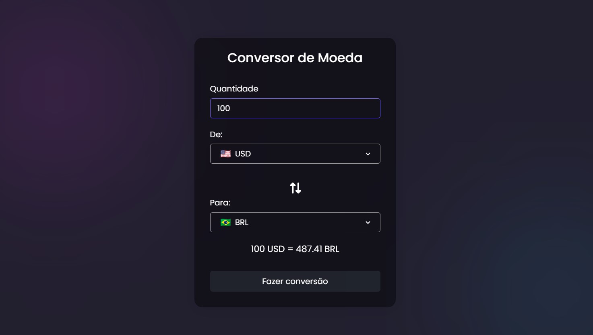

# Conversor de moeda

### Sobre o projeto
O conversor de moeda, ou câmbio de moeda, é uma forma de igualar valores perante duas unidades monetárias. Por exemplo, como saber quanto vale 1 real em moeda estrangeira? Podemos considerar o dólar americano (USD), a libra esterlina, o peso argentino e muitas outras moedas.

## Funcionamento

Para o funcionamento completo do conversor, você precisa de uma chave da API que puxa os valores, ela pode ser obtida gratuitamente no site https://app.exchangerate-api.com/, conseguindo a chave so adicionar no arquivo index.js na linha 26:

```javascript
const response = await fetch(`https://v6.exchangerate-api.com/v6/[YOUR_KEY]]/latest/${fromCur.value}`);
```

# Prévia do projeto


